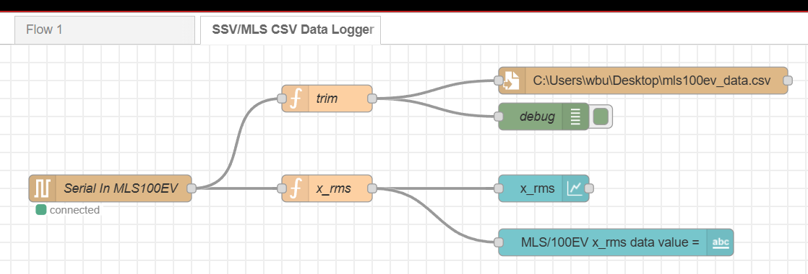
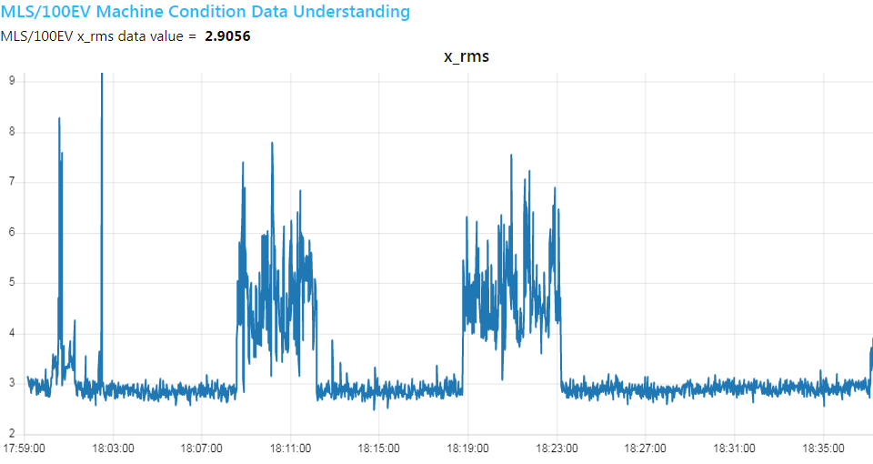
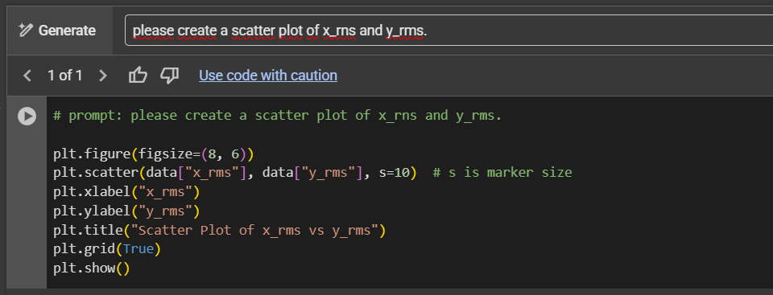
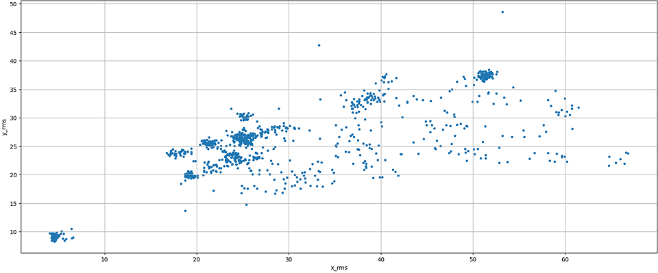
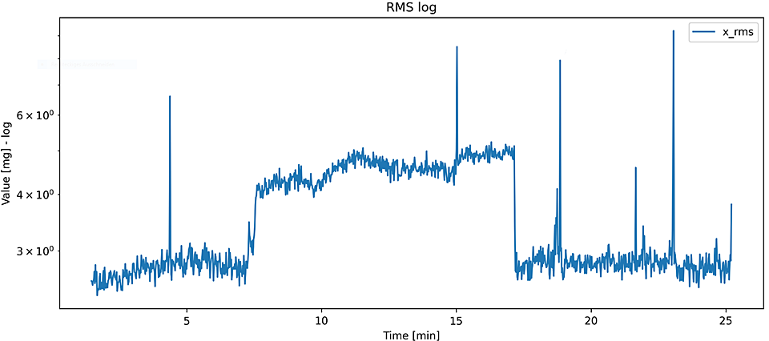

# Q & A: MACHINE CONDITION DATA UNDERSTANDING

## Why do you need to understand machine condition data?

The acquisition and analysis of machine data is a prerequisite for various optimization tasks in the field of machines and plants. Here are some examples for which high-quality condition data and the associated transparency are required:

+ **Optimization of production:** Data analysis can be used to identify bottlenecks in production and make optimizations.

+ **Increasing efficiency:** By analyzing machine data, processes can be optimized to avoid unnecessary expenditure, e.g. optimizing operating costs by reducing energy costs for electricity, gas, water, compressed air, etc.

+ **Predictive maintenance/condition monitoring:** The analysis of machine data makes it possible to identify potential faults at an early stage and proactively rectify them by optimizing the necessary maintenance tasks before they lead to failures.

+ **Improved availability:** Periodic condition data analyses, which are carried out automatically with the help of suitable (AI/ML) algorithms, allow maintenance schedules to be better planned and preventive maintenance measures to be carried out in order to reduce or, where possible, completely avoid downtimes.

## Who needs an understanding of machine condition data?

Both the machine manufacturer and the machine operator should have such an understanding of the data. Companies that specialize in the maintenance of machines and plants also benefit from an understanding of machine condition data.

For some, this improves their competitiveness – for example, machine manufacturers and maintenance companies through condition data-dependent service offers. Machine and plant operators, on the other hand, can use the understanding of data and the associated transparency for various operating cost optimizations.

## How does the MLS/100EV machine condition data understanding example work?

The required firmware is already pre-installed at the factory. If the MLS/100EV is supplied with power, a CSV data set with 22 elements is sent to the connected workstation via USB approx. every 1.5 seconds. This CSV data is generated by a periodic acceleration measurement of the X, Y and Z axes of the MLS/100EV using an IMU sensor (IMU = Inertial Measurement Unit), in other words an acceleration sensor.

This means that the three-dimensional acceleration of a vibration caused by a rotating drive element, for example, is measured.

After each measurement, a Fourier transformation (FFT = Fast Fourier Transformation) and other calculations are carried out. Among other things, a data element with the root mean square (RMS) is generated for each axis (x_rms, y_rms and z_rms – in practice an effective value).

To record the data in a CSV file, a workstation with a Node-RED installation including the Node-RED dashboard and a "serialport" node is required. The "SSV/MLS CSV Data Logger" is then imported into this Node-RED installation.

*Figure 1: Imported SSV/MLS CSV data logger flow*

This Node-RED flow fulfills three tasks:

1. Recording the data received from the MLS/100EV via the serial (USB) interface in a CSV file.

2. Display the complete CSV data set in the Node-RED debug window.

3. Real-time display of the **x_rms** data in the Node-RED dashboard.

## What is the line chart in the Node-RED dashboard for?

This representation is intended to help the user determine a suitable mounting point for the MLS/100EV on a machine housing or in a plant. You can immediately see whether the selected mounting point provides an acceleration data image that can be assigned to a specific machine state or whether different states can be differentiated via the line diagram.

Only then does data acquisition over a longer period of time make sense. Otherwise, the MLS/100EV should be mounted at a point that provides a better data image.

*Figure 2: Node-RED dashboard with incoming data*

## How is the analysis and visualization of the recorded CSV file done in Google Colab?

The individual steps are described in the file **[FIRST STEPS WITH MLS/100EV](https://github.com/SSV-embedded/MLS100EV/blob/main/README.md#42-data-analysis)** in the [MLS/100EV Github repository](https://github.com/SSV-embedded/MLS100EV/tree/main).

## Can I also analyze and process the CSV data with AI-generated code?

Google Colab contains the AI-based assistant **Gemini** to generate additional code for the analysis and visualization of the CSV data. So-called **prompts** are entered for this purpose.

> :information_source: **Please note:**
>
> In the following example, we assume that you have uploaded a CSV file with a header row so that Gemini can select the desired columns. 

Here is an example of such a prompt (we will publish more examples in this document):

Create a new code cell with `Ctrl`+ `B` `M` and click on the **generate** link in the code cell.

*Figure 3: Code cell with generate link*

Then enter e.g. the text “Please create a scatter plot with x_rms and y_rms.” as a prompt, click on **Generate** and then execute the code generated by Gemini.

*Figure 4: Code cell with prompt and the AI-generated code*

*Figure 5: Example of a scatter plot*

## Where can I find a description of the 22 data elements of the MLS/100EV CSV data set?

The individual data elements are described in the file **[FIRST STEPS WITH MLS/100EV](https://github.com/SSV-embedded/MLS100EV/blob/main/README.md#63-description-of-the-csv-data-set)** in the [MLS/100EV Github repository](https://github.com/SSV-embedded/MLS100EV/tree/main).

## Can the MLS/100EV only be used for rotating mechanical vibrations on a machine?

No, you can use the IMU of an MLS/100EV to record the acceleration of practically any mechanical vibration that falls within the IMU measuring range.

The following diagram is the result of the baking process of a convection oven, for example: The heating and cooling phases of such an oven cause thermal vibrations due to the temperature-related expansion and contraction of the metal parts. This results in mechanical vibrations that can be measured with an MLS/100EV.

*Figure 6: Diagram of a baking process of a convection oven*

## Can the MLS/100EV also be supplied by a power bank?

Yes, this is possible as long as the power bank provides a stable output voltage of 5 VDC.

In addition, you must monitor the charging status of the power bank.

> :information_source: **Please note:**
>
> We have not tested powering the MLS/100EV with a power bank. 

---

*author: wbu // review: kdw // 05-2025 // rev. 1.1*
