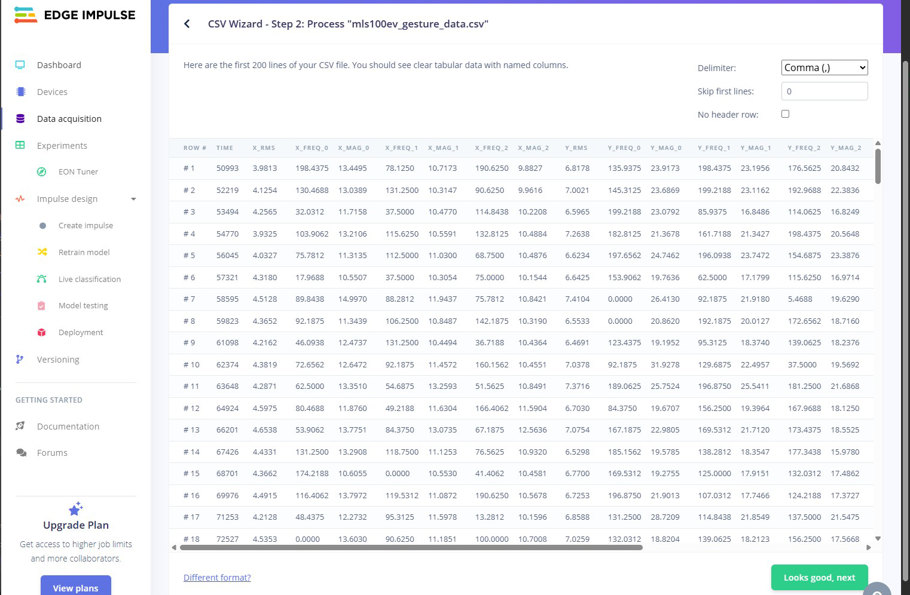

# MLS/100EV: ML MODEL USE CASE

# 1. INTRODUCTION

This document describes the workflow for building a firmware with an integrated ML model for the MLS/100EV with data from a CSV file. To build the ML model, we use the **[Edge Impulse](https://edgeimpulse.com/) AI development platform**. For the purpose of this document, a free Edge Impulse account is sufficient.

In our example we will create an ML model to **classify some gestures** like rotating the MLS/100EV or moving it up and down.

The ML model is then uploaded to the **MLS Firmware Build Service** where it is integrated into a firmware file for the MLS/100EV.

The ML firmware can then be loaded into the MLS/100EV to process the sensor data and to classify the gestures.

Of course you can also train and build an ML model to **classify the conditions of a machine**, such as a washing machine, a dishwasher, an oven or a heat pump. However, this is somewhat more complex and therefore more suitable for experienced users.  

> :information_source: **Please note:**
>
> The description in this document refers to a workstation running on Windows with Node-RED installed. Please read the [**MLS/100EV: IMU Data Use Case**](https://github.com/SSV-embedded/MLS100EV/tree/main) to see how to install and configure Node-RED on your workstation. This is required to record the sensor data.


*Figure 1: Workflow for building a firmware with an integrated ML model for the MLS/100EV*

## 1.1 Required Equipment

The following equipment is required to record data with the MLS/100EV:

+ A workstation with
    + Linux or Windows (version 10 or higher)
    + an Internet connection
    + a web browser
    + a USB port
    + installed Node-RED
    + installed terminal program like PuTTY or TeraTerm

+ An [Edge Impulse](https://edgeimpulse.com/) account (this is needed to build the ML model)
+ **Credentials for the MLS Firmware Build Service** (please contact our sales team)

# 2. SAFETY GUIDELINES

**Please read the following safety guidelines carefully! In case of property or personal damage by not paying attention to this document and/or by incorrect handling, we do not assume liability. In such cases any warranty claim expires.**

> :warning: **ATTENTION!**
>
> **OBSERVE PRECAUTIONS FOR HANDLING – ELECTROSTATIC SENSITIVE DEVICE!**

+ **The device is for indoor use only!**
+ **Do not expose the device to extreme temperatures, direct sunlight, extreme humidity or moisture. Avoid condensation at any time.**
+ **The power supply should be in immediate proximity to the device.**
+ **The power supply must provide a stable output voltage of 5 VDC.**
+ **Please pay attention that the power cord or other cables are not squeezed or damaged in any way when you set up the device.**
+ **Discharge yourself electrostatically before working with the device, e.g. by touching a metal radiator, to avoid damages.**
+ **Stay grounded while working with the device, to avoid damage through electrostatic discharge.**

# 3. PREPARATIONS

To build an ML model for the MLS/100EV, you need a CSV file with the recorded sensor data of the machine you want to monitor.

**Please read the [MLS/100EV: IMU Data Use Case](https://github.com/SSV-embedded/MLS100EV/tree/main) to see how to record the sensor data.**

## 3.1 Recording Data

It is important to record a certain amount of data to increase the accuracy of the ML model; **the more data, the better**.

For our example we will record three different conditions:

+ **Up/Down:** Move the MLS/100EV up and down, so that one pass takes approx. 1 or 2 seconds.
+ **Rotate:** Move the MLS/100EV clockwise, so that one pass takes approx. 1 or 2 seconds.
+ **Idle:** Do not move the MLS/100EV. Hold it still or leave it on a table while recording.

In order to obtain a good dataset, we recommend the following procedure:

1. Start recording and do not move the MLS/100EV for approx. 30 to 60 seconds.
2. Move the MLS/100EV 10 times up and down and then stop moving for approx. 10 seconds. Repeat this 10 times.
3. Do not move the MLS/100EV for 30 seconds.
4. Rotate the MLS/100EV 10 times clockwise and then stop moving for approx. 10 seconds. Repeat this 10 times.
5. Do not move the MLS/100EV for 30 seconds.
6. Stop recording.

> :bulb: **TIP!**
>
> Open the Node-RED dashboard while recording to see the live data diagram.

**We offer a [sample CSV file (mls100ev_gesture_data.csv) with gesture data in the same repository as this document](mls100ev_gesture_data.csv).**

## 3.2 Inserting a Header Line

> :information_source: **Please note:**
> 
> The CSV file has no header line with the names of the individual columns. To make your work easier, we recommend adding the header line before working with the CSV file in Edge Impulse.
> 
> **Our [sample CSV file](mls100ev_gesture_data.csv) already contains the header line!**

For your own IMU sensor data, simply copy the following line and paste it without any changes as the first line in your CSV file:

```
time,x_rms,x_freq_0,x_mag_0,x_freq_1,x_mag_1,x_freq_2,x_mag_2,y_rms,y_freq_0,y_mag_0,y_freq_1,y_mag_1,y_freq_2,y_mag_2,z_rms,z_freq_0,z_mag_0,z_freq_1,z_mag_1,z_freq_2,z_mag_2
```
*IMU sensor data header line*

# 4. BUILDING AN ML MODEL

Log into [Edge Impulse](https://edgeimpulse.com) and you will see your project dashboard.


*Figure 2: Project dashboard at Edge Impulse*

> :bulb: **TIP!**
>
> You can change the project name by simply clicking on it.

## 4.1 Configuring the Data Acquisition Format

Click on **Add existing data** in the Getting started box of the dashboard and then on **Upload data**.

In the **Upload data dialog** click on the **configure the CSV Wizard** link.

The CSV Wizard allows users with larger or more complex datasets to easily upload their data without having to worry about converting it to the data acquisition format.


*Figure 3: Upload data dialog box*


In the first step of the **CSV Wizard** choose your CSV file and click the **`Upload file`** button.

The window of the second step should look like this:



*Figure 4: CSV Wizard step 2*

Click on the **`Looks good, next`** button to go to step 3.

In the third step choose following options:

+ **Is this time-series data?**
    + Yes, this is time-series data
+ **How is your time-series data formatted?**
    + Each row contains a reading, and sensor values are columns.
+ **Do you have a timestamp or time elapsed column?**
    + Yes, it's time.
+ **What type of data is in your timestamp column?**
    + Time elapsed in milliseconds
+ **Override timestamp difference?**
    + Enter **1275 ms**.
    
> :information_source: **Please note:**
> 
> **The value of 1275 ms is important because the MLS/100EV sends its data at this interval.**

Now click on the **`Great, let's look at your values`** button to go to step 4.


*Figure 5: CSV Wizard step 3*

In the next step choose following options:

+ **Do you have a column that contains the label?**
    + No
+ **Which columns contain your values?**
    + x_rms
    + y_rms
    + z_rms

Click on the **`Next, split up into samples`** button to go to step 5.


*Figure 6: CSV Wizard step 4*

In the last step choose following options:

+ **How long do you want your samples to be?**
    + Unlimited

Click on the **`Finish wizard`** button to finish the CSV Wizard.


*Figure 7: CSV Wizard step 5*

> :information_source: **Please note:**
> 
> Any CSV files that you upload into your project - whether it's through the uploader, the CLI, the API or through data sources - will now be processed according to the rules you set up with the CSV Wizard!

##  4.2 Uploading the CSV File

Open the dashboard, click on **Add existing data** in the Getting started box and then on **Upload data**.

In the Upload data dialog choose following options:

+ **Upload mode**
    + Select individual files
+ **Select files**
    + Choose the same CSV file you used for the CSV Wizard
+ **Upload into category**
    + Training
+ **Label**
    + Leave data unlabeled

Click the **`Upload data`** button.


*Figure 8: Upload data dialog*

After successfully uploading the data, close the dialog box.

## 4.3 Splitting the Dataset

The uploaded CSV file is now listed in the **Dataset box**.

To build an ML model, the data must be labeled. Therefore, the data set must be split into individual segments, each representing a specific state.

To split the dataset, click in the line with your CSV file on the **menu icon**  to open the context menu and choose **Split sample**.


*Figure 9: Dataset context menu*

Now you can split the dataset into individual segments. If there are already segments, please remove them.

First, **set the segment length and enter 1275 ms** in the text field, then click on **`Apply`**.


*Figure 10: Determining the segment length*

To simplify the task, you can enlarge the diagram. Click on the **`Zoom`** button and navigate through the diagram using the handles next to the axes.


*Figure 11: Zoomed diagram*

Now click on the **`+Add Segment`** button, click in the diagram and place the segment. Each segment should cover the pattern of a complete state like shown in the following figure. Repeat this until the entire diagram is covered.


*Figure 12: Adding segments*

When you are done, click the **`Split`** button.

## 4.4 Labeling the Data

The individual data samples are now listed in the **Dataset box**.

On the right-hand side you can see the data diagram of the selected sample.

To label the data samples, click on the **select multiple items icon** , select the desired items and click on the **`Edit labels`** button. Now enter the label for the state/condition that these data samples represent.

To label an individual data sample, open the context menu  of the desired sample and choose **Edit label**.

In our example, we use three different labels: **updown**, **clockwise** and **idle**. 


*Figure 13: Labeling the dataset*

## 4.5 Dividing the Samples into Training and Test Data

Now that the data samples are labeled, they need to be divided into a training dataset and a test dataset.

> :bulb: **TIP!**
>
> A good ratio is something around **80% training data and 20% test data for each label**. The ratio refers to the **length of time** covered by the data. For example, if your data covers a period of 10 minutes, take 8 minutes for training and 2 minutes for testing. This ratio applies to each label.

Currently, all samples are in the training dataset.

To move the samples, click on the **select multiple items icon** , select the desired samples and click on the **`Move to test set`** button.

To move an individual data sample, open the context menu  of the desired sample and choose **Move to test set**.


*Figure 14: Select samples for the test set*

Do not worry, if the info box with the **train/test ratio shows a warning** after dividing the data samples. Click the **warning icon** next to the split ratio to open a more detailed view of the train/test split ratio.


*Figure 15: Test set overview*

The info box with the detailed view helps you figure out how to adjust the ratio between training and test data.

**We do not recommend to perform the automatic split, as this cannot be undone.**

Simply move missing samples manually to the test set until you achieve the desired ratio.


*Figure 16: Detailed view of the train/test split ratio*

## 4.6 Creating an Impulse

> :information_source: **Please note:**
> 
> An impulse takes raw data, uses signal processing to extract features, and then uses a learning block to classify new data.

### 4.6.1 Input Block

Click in the menu sidebar on **Create impulse**.

Then click on **Add an input block** and select **Time series data**.

Now enter the following values:

+ **Window size**
     + 1275 ms
+ **Window increase (stride)**
     + 1 ms


*Figure 17: Configuring the time series data input block*

### 4.6.2 Processing Block

Click on **Add a processing block** and choose **Raw data** from the list.


*Figure 18: Impulse with raw data block*

### 4.6.3 Learning Block

Click on **Add a learning block** and choose **Classification** from the list.


*Figure 19: Impulse with classification block*

Now click on the **`Save Impulse`** button.

## 4.7 Generating Features

Click on **Raw data** in the sidebar menu.

Click on the **`Generate features`** button at the top and then on the **`Generate features`** button in the **Training set box**.

The feature generation may take a while. You can see the progress in the **Feature generation output box**.

When the process is complete, a diagram will be displayed in the **Feature explorer box** on the right-hand side. The individual labels should be clearly seperated from each other.


*Figure 20: Feature generation*

## 4.8 ML Model Training
Click in the menu sidebar on **Classifier** and enter the following values in the **Neural network settings box**:

+ **Number of training cycles**
     + 50
+ **Batch size**
     + 1
+ **Profile int8 model**
     + Select the checkbox

Now click on the **`Save & train`** button to start the ML model training. The training may take a while. You can see the progress in the **Training output box** on the right-hand side.

When the training is complete, you can view some information about the model in the **Model box**, such as its accuracy. The accuracy should be as high as possible, at least 95%, and the loss should be as low as possible.


*Figure 21: Information about the trained model*

> :bulb: **TIP!**
>
> In the data explorer diagram you can hide/show the correct/incorrect labels by clicking on them in the legend.

## 4.9 ML Model Testing

Click on **Model testing** in the sidebar menu and then on the **`Classify all`** button.

The testing may take a while. You can see the progress in the **Model testing output box** on the right-hand side.

When the testing is complete, you can view some information about the test in the **Results box**, such as its accuracy. The accuracy should be as high as possible, at least 95%.


*Figure 22: Information about the model testing*

## 4.10 Deployment and Download of the ML Model

If the test results are satisfactory, the ML model can be build.

Click on **Deployment** in the sidebar menu and then on **Search deployment options**.

### 4.10.1 ML Model for Node-RED

To build an **ML model for Node-RED**, select **WebAssembly** from the list, click on the **`Select`** button under **Unoptimized (float32)** and then click on the **`Build`** button at the bottom.

The model building process may take a while. You can see the progress in the **Build output box** on the right-hand side.

When the model is ready, you will be offered to **download a ZIP-file**. Save the ZIP-file on your workstation.


*Figure 23: Model building for Node-RED*

### 4.10.2 ML Model for Firmware

To build an **ML model for firmware integration**, select **C++ library** from the list, make sure that **TensorFlow Lite** is selected, click on the **`Select`** button under **Unoptimized (float32)** and then click on the **`Build`** button at the bottom.

The model building process may take a while. You can see the progress in the **Build output box** on the right-hand side.

When the model is ready, you will be offered to **download a ZIP-file**. Save the ZIP-file on your workstation.


*Figure 24: Model building for firmware*

# 5. USING THE ML MODEL WITH NODE-RED

> :information_source: **Please note**
>
> Please read the [**MLS/100EV: IMU Data Use Case**](https://github.com/SSV-embedded/MLS100EV/tree/main) to see how to install and configure Node-RED on your workstation.

## 5.1 Installing the Edge Impulse Node

To use the ML model with Node-RED, a special **Edge Impulse node** must be installed.

Open Node-RED, click the **menu icon** in the top right corner and click **Manage palette**.

Click on the **Install** tab in the palette dialog and enter **edge-impulse** in the search bar.


*Figure 25: Palette search results*

Look for **node-red-contrib-edge-impulse** in the search results and click the **`Install`** button. Confirm the installation in the upcoming message and click the **`Close`** button.

## 5.2 Extracting the ZIP-File

Extract the ZIP-file with the ML model ([see chapter 4.10.1](#4101-ml-model-for-node-red)). It contains the two directories node and browser.

> :information_source: **Please note:**
> 
> **Make sure that you save these directories in a location where Node-RED can access them!**

## 5.3 Importing the Classification Flow

Now open the **SSV/MLS Data Logger flow** from the [**MLS/100EV: IMU Data Use Case**](https://github.com/SSV-embedded/MLS100EV/tree/main).

Download the [`mls_classify_imu_data_flow.json`](mls_classify_imu_data_flow.json) file. You will find this flow in the same repository as this document.

Then click the **menu icon** in the top right corner and click **Import**. In the next dialog select the downloaded `mls_classify_imu_data_flow.json` file and click the **`Import`** button at the bottom.


*Figure 26: Importing flow*

Place the new flow below the data logger flow like shown in the following figure.

> :information_source: **Please note:**
> 
> If the flow shows any errors, please make sure that you have installed the **Edge Impulse node** ([see chapter 5.1](#51-installing-the-edge-impulse-node))!


*Figure 27: Classification flow*

### 5.3.1 Configuring the Classification Flow

The Classification flow requires the data from the extracted ZIP file.

Therefore, double click the **classify node** to open its properties dialog, enter the **path to the node directory** and click the **`Done`** button.


*Figure 28: Properties of the classification flow*

Now draw a wire between the **Serial In MLS100EV** node and the **rms** node, disable the upper debug node for greater clarity and click on the **`Deploy`** button.

The complete flow should now look like in the following figure:


*Figure 29: Wired classification flow*

Connect the MLS/100EV to the workstation and perform some of the trained gestures.

The debug window will now display the classification results of the ML model.


*Figure 30: Classification results*

**Congratulations! You successfully trained, built, and deployed your own ML model.** :slightly_smiling_face:

# 6. BUILDING A FIRMWARE WITH INTEGRATED ML MODEL

> :information_source: **Please note:**
> 
> **To build a firmware with your ML model integrated, you need an account for the MLS Firmware Build Service (MFBS). Therefore, please contact our sales team.** 

Open the URL **https://ssv-mls.ssv-service.de/** and enter your credentials.

Now drag and drop the ZIP-file in the drop zone; the building process will start immediately and may take a while.

When the status shows **Done**, click on **Download files** and save the ZIP-file.


*Figure 31: MLS Firmware Build Service user interface*

Extract the **``zephyr.signed.bin``** from the ZIP-file.

## 6.1 Flashing the MLS/100EV with the New Firmware

**Please read the [MLS/100EV: IMU Data Use Case](https://github.com/SSV-embedded/MLS100EV/tree/main) to see how to flash the MLS/100EV.**

> :information_source: **Please note:**
> 
> Use the same connection parameters as for the serial connection in Node-RED: **8 N 1 , 115.200 baud**.

Select the **``zephyr.signed.bin``** to flash the MLS/100EV.

When the flashing is completed, open a **terminal program** like PuTTY or TeraTerm to display the serial output of the MLS/100EV.

Now perform some of the trained gestures and you will see the classification results in the terminal window.


*Figure 32: Serial output with classification results*

**Congratulations! You successfully integrated your own ML model into the MLS/100EV.** :thumbsup:

# 7. HELPFUL LITERATURE

+ [Node-RED](https://nodered.org)
+ [Edge Impulse Documentation](https://docs.edgeimpulse.com/docs)
+ [Edge Impulse Forum](https://forum.edgeimpulse.com/docs)
+ [MLS/100EV: IMU Data Use Case](https://github.com/SSV-embedded/MLS100EV/tree/main)

---

*author: wbu // review: adi // 08-2025 // rev. 1.0*
